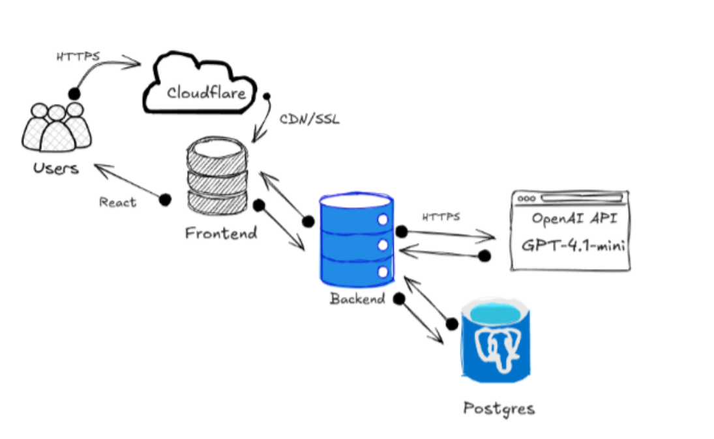
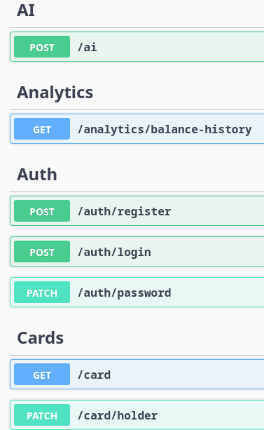
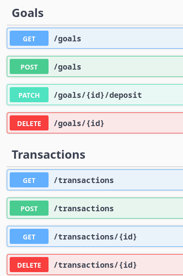

<div align="center">


# FinanceThinking

**AI-powered personal finance tracker with real-time analytics**

[ Live Demo](https://danilanet.id.lv) · [ Swagger API](https://api.danilanet.id.lv/swagger)

</div>

---

## Features

| Feature                  | Description                                |
| ------------------------ | ------------------------------------------ |
| **Transaction Tracking** | Log income and expenses with categories    |
| **Balance Analytics**    | Real-time balance history chart            |
| **AI Financial Advisor** | Chat with GPT-4.1-mini about your finances |
| **Goal Planning**        | Create savings goals and track progress    |
| **Theme Switcher**       | Dark, Green, Purple, Beige themes          |
| **Authentication**       | JWT-based login and registration           |
| **Public URL**           | Deployed via Cloudflare Tunnel             |

## Architecture



## Tech Stack

**Frontend**

- Next.js 16 + React + TypeScript
- Tailwind CSS
- Framer Motion
- Recharts

**Backend**

- ASP.NET Core 8
- Entity Framework Core + Npgsql
- OpenAI .NET SDK 2.10
- Swagger / OpenAPI

**Infrastructure**

- PostgreSQL 17
- Cloudflare Tunnel
- GitHub Actions CI/CD

---

### 3. Run backend

```bash
dotnet run --project AIProject/AIProject.csproj
```

### 4. Run frontend

```bash
cd src
npm install
npm run dev
```

## API Endpoints

<table>
  <tr>
    <td valign="top" align="center" style="padding: 10px;">
      
    </td>
    <td valign="top" align="center" style="padding: 10px;">
      
    </td>
  </tr>
</table>

<p align="center">
  <em>System API documentation with Swagger implementation</em>
</p>

Full docs available at `/swagger`

<div align="center">

Made with love by [Dalik0v](https://github.com/Dalik0v)

</div>
